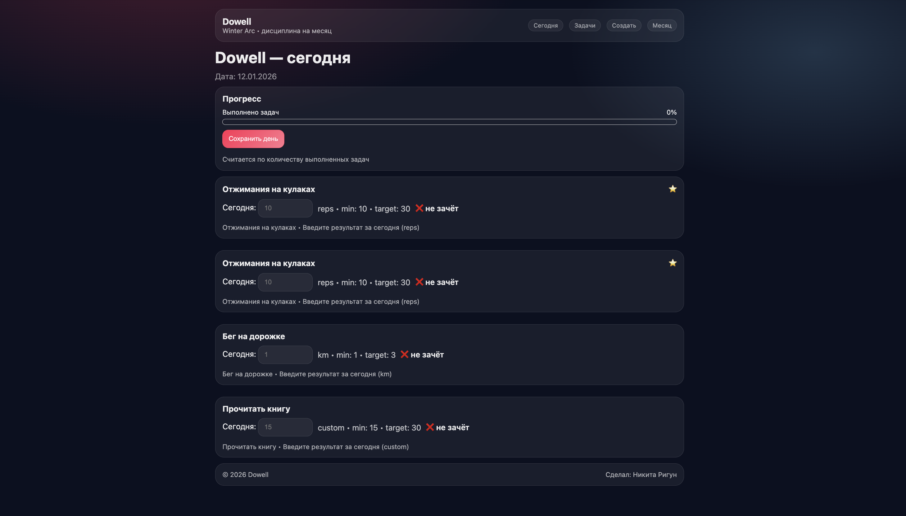
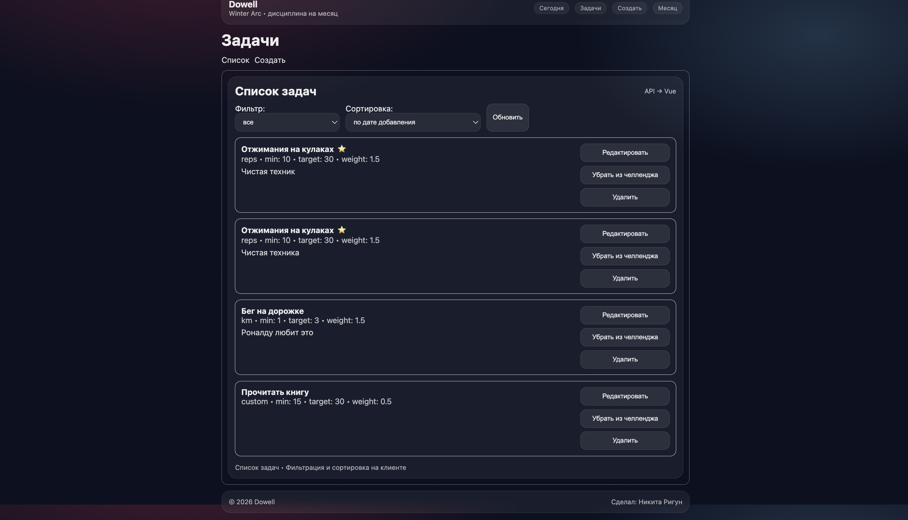
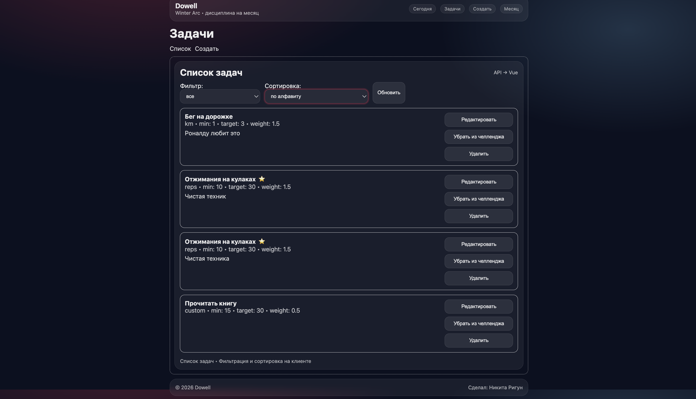
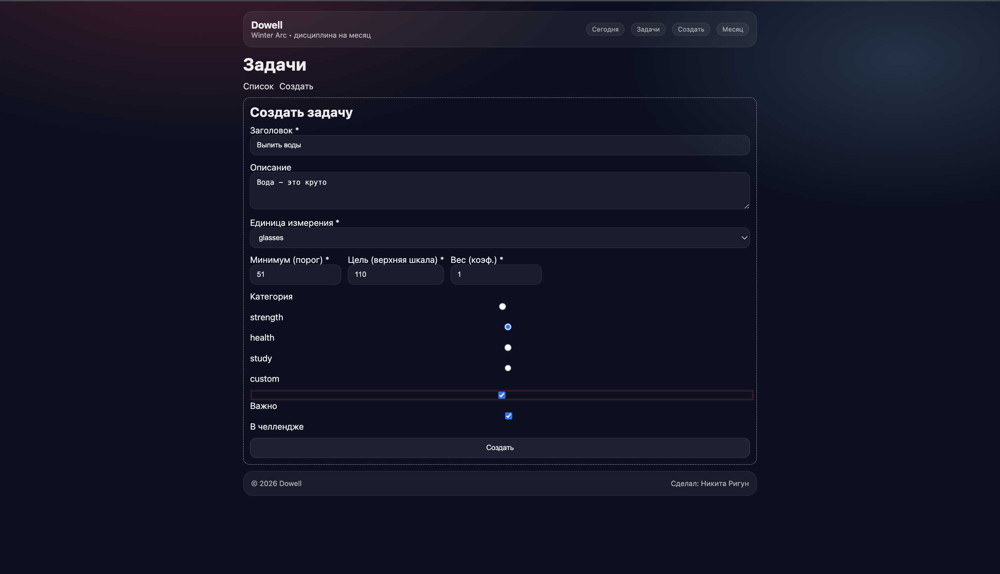
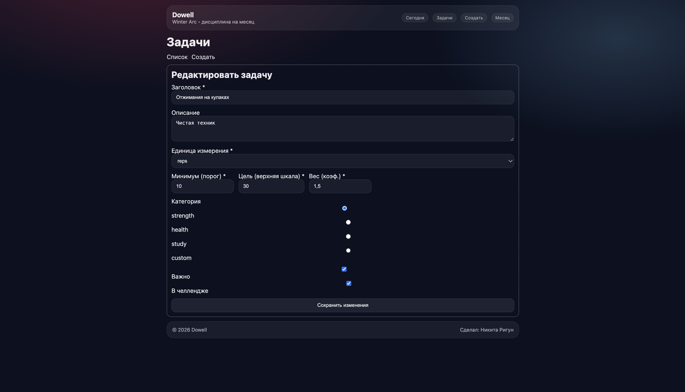
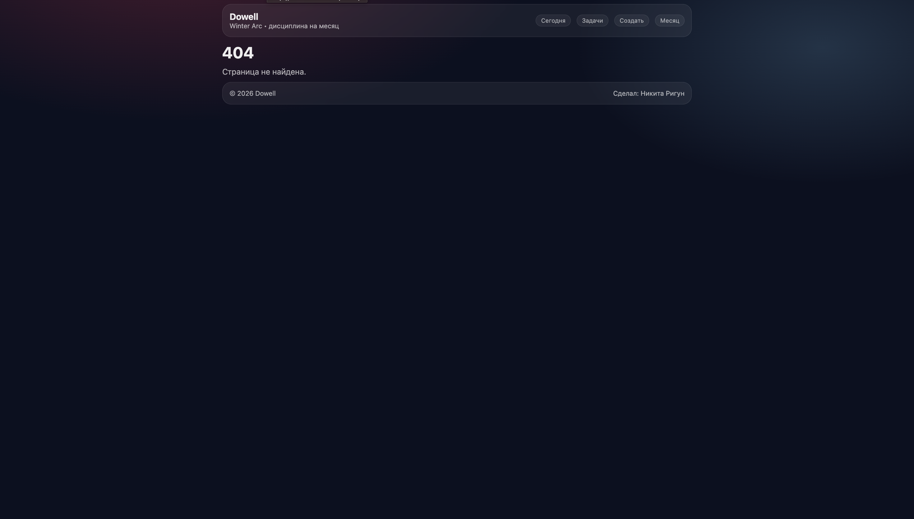

## Разработка SPA-приложения на Vue 3 с серверной частью на Python

---

## 1. Титульная часть

**Автор:** Ригун Никита  
**Группа:** P3468  
**Дата:** 12.01.26  
**Название работы:**  
Разработка SPA-приложения на Vue 3 с серверной частью на Python и запуском в Docker

---

## 2. Цель работы

Целью данной работы является освоение разработки одностраничных приложений (SPA) с использованием Vue 3, а также изучение взаимодействия клиентской части с сервером через REST API.

В ходе выполнения работы изучаются:
- реактивная модель данных Vue 3;
- работа с формами и пользовательским вводом;
- компонентный подход;
- маршрутизация;
- серверная разработка на Python;
- контейнеризация приложения с помощью Docker.

---

## 3. Реализованный функционал

### Клиентская часть (Vue 3)

В приложении реализованы следующие компоненты:

- `AppHeader.vue` — верхнее меню навигации  
- `AppFooter.vue` — нижняя панель  
- `TaskList.vue` — список задач  
- `TaskItem.vue` — отображение одной задачи  
- `TaskForm.vue` — форма создания и редактирования  
- `DailyTaskRow.vue` — ввод ежедневных результатов  
- `ProgressBar.vue` — визуальный прогресс выполнения  
- `LayoutCard.vue` — компонент-контейнер с поддержкой слотов  
- `DaySummaryModal.vue` — модальное окно с итогами дня  

---

### Реактивность, computed и watch

Для управления состоянием приложения используются `ref` и `reactive`.  
Вычисляемые свойства (`computed`) применяются для:

- фильтрации задач по статусу (активные / неактивные);
- сортировки задач по алфавиту, сложности и дате;
- подсчёта количества выполненных задач;
- расчёта прогресса выполнения и итогового балла.

Наблюдатели (`watch`) используются для отслеживания изменений фильтров и параметров сортировки, что позволяет автоматически обновлять интерфейс без ручного вмешательства.

---

### Слоты

В компоненте `LayoutCard.vue` используются:
- обычный слот для основного контента;
- именованные слоты (`header`, `footer`);
- scoped slot, передающий мета-информацию во вложенные компоненты.

---

### Маршрутизация

Реализованы следующие маршруты:

- `/` — главная страница (Dashboard)
- `/tasks` — список задач
- `/tasks/new` — создание задачи
- `/tasks/:id/edit` — редактирование задачи
- `/month` — результаты за месяц
- `*` — страница 404

Используются маршруты с параметрами, именованные маршруты и программная навигация.

---

### Серверная часть (Python)

Сервер реализован на FastAPI и включает:

- CRUD-операции для задач:
  - `GET /api/tasks`
  - `POST /api/tasks`
  - `PUT /api/tasks/{id}`
  - `DELETE /api/tasks/{id}`
- сохранение ежедневных результатов:
  - `POST /api/logs/today/submit`
  - `GET /api/logs/month`
- хранение данных в PostgreSQL с использованием SQLAlchemy.

---

## 4. Скриншоты интерфейса

### 1. Главная страница


### 2. Список задач


### 3. Фильтрация и сортировка


### 4. Форма создания задачи


### 5. Форма редактирования задачи


### 6. Страница 404


---

## 5. Пример кода

Пример вывода списка задач с использованием `v-for`, передачи данных через `props` и обработки пользовательских событий:

```vue
<TaskItem
  v-for="task in sortedTasks"
  :key="task.id"
  :task="task"
  @remove="removeTask"
  @toggle-active="toggleTaskActive"
/>
Пример вычисляемого свойства, реализующего фильтрацию задач:

js
Копировать код
const filteredTasks = computed(() => {
  if (filter.value === 'active') {
    return tasks.value.filter(t => t.active)
  }
  if (filter.value === 'inactive') {
    return tasks.value.filter(t => !t.active)
  }
  return tasks.value
})
Данный код демонстрирует использование реактивных данных и вычисляемых свойств, которые автоматически пересчитываются при изменении состояния приложения.

6. Пример данных (PostgreSQL / JSON)
Пример структуры задачи:

json
Копировать код
{
  "id": 1,
  "title": "Отжимания на кулаках",
  "description": "Ежедневная физическая активность",
  "unit": "повторы",
  "min_value": 10,
  "target_value": 30,
  "weight": 1.5,
  "active": true,
  "important": true
}
Пример сохранённого дня:

json
Копировать код
{
  "day": "2026-01-12",
  "score": 82,
  "failed": false,
  "completed_count": 4,
  "total_count": 5
}
7. Инструкция по запуску (Docker)
Для запуска проекта используется Docker Compose.

bash
Копировать код
docker compose up --build
После запуска:

frontend доступен по адресу http://localhost:8080

backend документация — http://localhost:8000/docs

8. Выводы
В ходе выполнения работы были изучены:

структура и синтаксис Vue 3;

реактивность и вычисляемые свойства;

компонентный подход;

маршрутизация SPA-приложений;

работа с формами;

API-взаимодействие;

разработка серверной части на Python;

работа с Docker;

структурирование SPA-проекта.